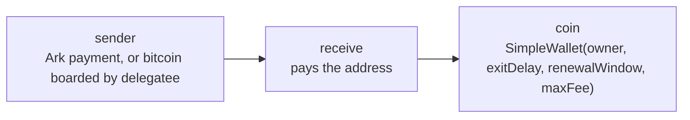
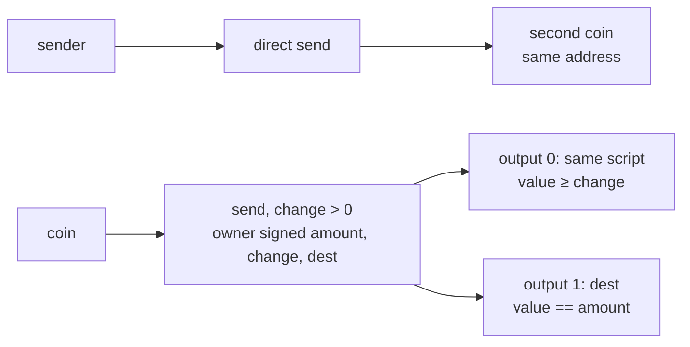
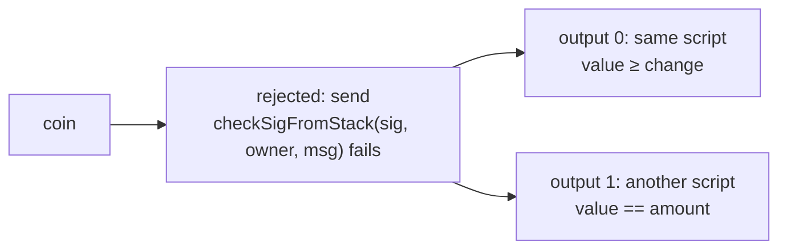
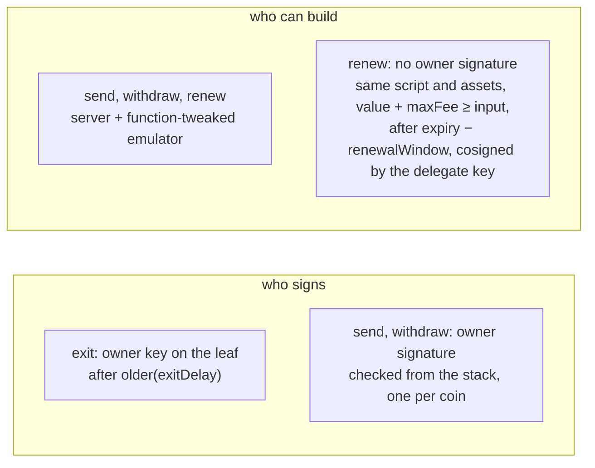

# Simplest Wallet

An Arkade wallet without an SDK and without PSBTs. The wallet holds one key and
signs short messages. [delegatee](https://github.com/arkade-os/delegatee)
builds every transaction, and the emulator co-signs one only when the
contract below accepts it.

- **Receive:** show an Ark address, or a bitcoin address that delegatee boards
  automatically.
- **Send:** sign one message per spent coin and `POST /v1/spend`.
- **Renew:** nothing to do; delegatee renews the coins before they expire.

## Run

Needs the regtest stack of delegatee (`make regtest-up`) and a delegatee
with the spend endpoint, listening on `config.json`'s `delegateeUrl`:

```sh
npm install        # only for the e2e; the page loads its three libraries from esm.sh
npm run serve      # http://localhost:8000
npm run e2e        # board, send, exit to bitcoin, send everything, spend several coins
```

## Networks

`networks.json` holds a preset per network; `NETWORK=mutinynet npm run config`
writes it to `config.json` (regtest by default). The page reads
`config.json`.

## Deploy

`.github/workflows/pages.yml` publishes the page on GitHub Pages for the
network named by the repository variable `NETWORK` (mutinynet by default).
It needs a delegatee with the spend endpoint at that network's `delegateeUrl`.

## Files

| | |
|---|---|
| `contract/simple_wallet.json` | the contract (compiler artifact) |
| `contract/renewal.json`, `contract/boarding.json` | delegatee watches: renew the coins, board deposits |
| `wallet.js` | keys, addresses, authorizations, delegatee API |
| `index.html` | the page |
| `networks.json`, `config.json` | network presets, the one in use |
| `e2e.mjs` | the end-to-end test |

## The contract

`SimpleWallet(owner, exitDelay, renewalWindow, maxFee)` has four leaves:

| leaf | spends |
|---|---|
| `exit` | `<exitDelay> CSV DROP <owner> CHECKSIG`: unilateral exit |
| `renew` | through any batch, back to the same script, within `renewalWindow` of expiry, paying at most `maxFee` |
| `send` | in an Ark transaction, as the owner authorized |
| `withdraw` | in a batch, to a bitcoin output, as the owner authorized |

### The story

1. The coin the person sends: any payment to the address is one coin of the wallet.



2. A direct send is a second coin beside the change of a `send`; the wallet counts both, its balance being every coin on the address.



3. Rejected: a `send` paying a script the owner did not sign; it balances, but `checkSigFromStack` fails because the message hashes `dest`.



4. Who signs versus who can build: a `require` is not authorization, so `renew` moves coins with no owner signature, back to the same script only.



Enforced: the destination, amount, change and deadline the owner signed, the
change back to the same script, and renewals that keep the coin on its script.
Not claimed: that delegatee or the server stay online, that renewals happen
in time, or the emulator keys (see below).

`send` and `withdraw` are `SERVER + EMULATOR` leaves whose arkade script
checks a BIP340 signature from the stack (`OP_CHECKSIGFROMSTACK`) by the
owner, one per input, over

```
SHA256(tag ‖ prev_txid ‖ vout:u32le ‖ amount:u64le ‖ change:u64le ‖ valid_until:u64le ‖ SHA256(dest_version ‖ dest_program))
```

- `tag` is `simplestwallet/send/v1` or `simplestwallet/withdraw/v1`, so a send
  authorization never pays out on chain.
- `prev_txid` is in internal byte order. For `send` it is the checkpoint
  transaction arkd places between the coin and the Ark transaction: the wallet
  computes it from arkd's checkpoint tapscript (`checkpointTxid` in
  `wallet.js`), and `vout` is 0.
- When `change > 0`, output 0 must go back to the same script with at least
  `change`, and the payment must be exactly `amount`. When `change` is 0 there
  is no change output and the payment is at least `amount`.
- `valid_until` (unix time, checked with `OP_CHECKTIME`) ends the authorization
  with the spend request, so a failed send cannot be replayed later.
- Each signature names its coin, so it dies once that coin is spent. A subset
  of the coins cannot fund the outputs, because value cannot be created.
- A `withdraw` also checks the output count, so the fee budget
  (`withdrawFeeMax`) can only go to arkd's fee, capped by the template.

delegatee registers a spend only with a second signature, by the key of an
exit leaf of every coin, over `tagged_hash("delegatee/spend", id ‖ expires_at)`.

## Trust and limits

- The wallet checks that the address delegatee derives contains its exit leaf
  and that every other leaf is a 2-of-2 with the ark server. It does not check
  that the emulator keys are tweaked correctly. Without the emulator, only the
  unilateral exit remains, and this page has no button for it.
- A spend ends `done` when its coins are spent, by it or by something else (a
  renewal that started first): the page reports a send only when delegatee
  spent the coins itself, and skips coins about to renew.
- The key sits unencrypted in `localStorage`: fine for regtest only.
- BTC only: coins carrying assets cannot be spent by these templates.
- One address per wallet.
- Collaborative exit (`withdraw`) needs an emulator that signs an intent with
  onchain outputs when its arkade scripts check `onchain_output_indexes`;
  released emulators refuse every such intent (emulator #137). The page then
  says the server does not send to bitcoin addresses yet.
